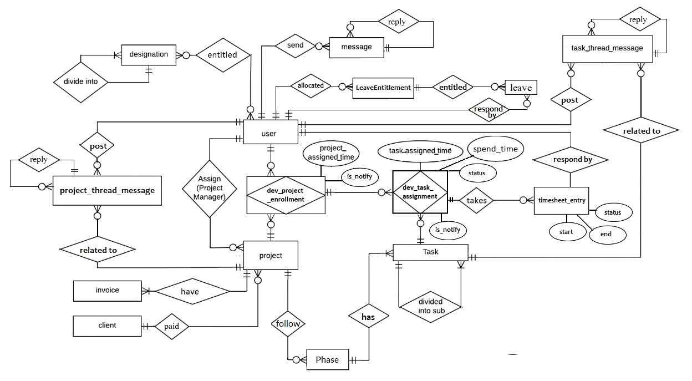
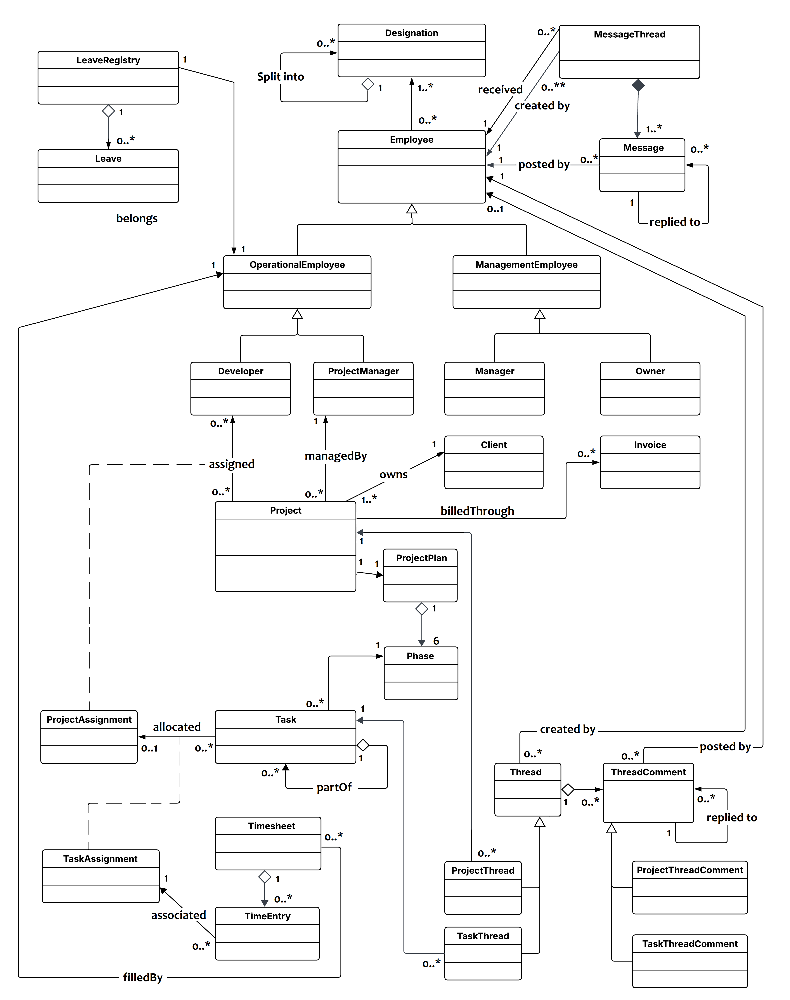

## description
what we going to do and .....

two methods 
1. draw overall class diagram for the poroject and divide it into modules
2. draw seperate class diagrams for each module

## Requirments

### Project management module 
| Authorized | Description |
| --- | --- |
| Owner | Create project profile with Client information |
| Owner | Add project Details to project profile |
| Owner | Add Scheduled Dates to project profile such as Delivery Date, deadline |
| Owner | Categorize Projects as local or foreign |
| Owner | Managing project profile |
| Owner, Manager, PM, Assigned Dev | View project profile |
|  | project statuses: Initiated, In Progress, On Hold, Completed, Cancelled. |
| |
| | **Project timeline** |
|  | set,Display Scheduled Milestones for the project |
|  | set,Display Actual Duration of Milestones for the project |
|  | mark complete for Actual Milestones of the project |
| |
| | **Project costing** |
| Manager, Owner, Assigned PM | Add costing factors and cost |
| Manager, Owner, Assigned PM | Calculate Employee cost (Employee cost  = employee cost rate * time) |
| Manager, Owner, Assigned PM | Calculate total Cost |
| Manager, Owner, Assigned PM | Add incomes to the project cost profile |
| Manager, Owner, Assigned PM | deduct income amount from cost.(Calculating profit) |
| Manager, Owner, Assigned PM | list income, costs , filter by (incomes, costs) |

***

### Task Management Module
| Authorized | Description |
| --- | --- |
| Assigned PM | Divide project into sub tasks that consist of maximum three levels. |
| PM | set Estimate time, Delivery date to the Tasks |
| Dev | Submit task with Spend time and additional comment.(done/cannot done) |
| | view task info(including delivery status) |
| | Add priority levels (High, Medium, Low) and allow sorting/filtering |
| | Attach documents, screenshots, or specifications to each task |

### Task Progress Monitoring Module
    project wise => Color-coded Task Status Visualization by progress (e.g., Not Started, In Progress, Done, Blocked).
    show percentages for each progress level
    Project Completion % = (Number of Done tasks/Total number of tasks) * 100%

    project wise => view tasks exceed the deadline/ ontime/before time/near to deadline

    pm,owner,manager,ASSIGEND EMP--> view Project progress in tasks.
    (owner, manager,pm--> calculat and show Project Estimate time.(WHEN ALL TASK EST TIME SET)

    //show  recent tasks that complete
    show  recent tasks that have to complete(near deadline)  
    show  recent tasks that exceed the deadline

    //task => Attach documents, screenshots, or file to each task.

***

### Timesheet management
| Authorized | Description |
| --- | --- |
| PM, Dev | manage time sheets for weekly basis |
| Manager, Owner | approve all users timesheets |
| Manager, Owner | view all users timesheets(monthly,weekly) |
| | can Mark leave days in timesheet |

***

### User management module	 
    managing General information of the users
    •   Owner can manage manager, Developers and PM’s general information.
    •   Manager can manage Developers and PM’s general information.
    •   Anyone can manage his/her own account general information.

    manager,owner-->Manage Emp. Salary information, Employee hourly rate(monthly salary/22days*8 hours), EPF-ETF details and 
    Education Qualifications
    •   Manager can manage above details of Developers and  PM
    •   Company owner can manage above details of Manager, Developers and  PM’s

    Admin level users can manage other user accounts (CRUD,working/resign manage)
    •   Manager can create, delete and change working status of Developers and PM’s
    •   Company owner can create, delete and change working status of manager, Developers and PM’s.

    developer,PM -  manage skill list.

	//>system shall give Users authenticate
	//>system shall be able given appropriate privileges according to their user role.
        
***

### Designation Management
| Authorized | Description |
| --- | --- |
| Owner | Manage designation hierarchy |
| Owner | Manage designation ,sub designation information |
| |
| | admin level users can manage designations of users |
| Owner | Manage designation of manager, PM’s and Developers |
| Manager | Manage designation of PM’s and Developers |

***

### Communication module
| Authorized | Description |
| --- | --- |
| | Users shall be able pass private messages to other users(Able to upload files with private messages) |
| Project assigned dev, PM, Manager, Owner | thread to each project. can post and see messages in that thread |
| Task assigned dev, Project assigned PM, Manager, Owner| thread to each Task.can post and see messages in that thread |

~~message                => Attach documents, screenshots, or file to each~~  
~~project thread message => Attach documents, screenshots, or file to each~~  
~~task thread message    => Attach documents, screenshots, or file to each~~  
***

### Reporting module
    PM, manager and owner => view employee(developer/pm) Project wise timing (spend time, schedule time)
    PM, manager and owner => view Designation wise spend time for a project (spend time, schedule time)

    Dashboard page
        show  recent projects that engaged in with deadlines
        show  recent projects that completed
        show  recent projects that delayed with deadlines

        show  recent tasks that complete
        //show  recent tasks that have to complete  
        //show  recent tasks that exceed the deadline  

    Deadline Calendar View
        view of project deadlines in Today, week, Month. 
        view of tasks deadlines in Today, week, Month.  

    Developer monthly efficincy report
        tasks delayed, tasks on time, tasks before time

    yearly calendar - show Planned and actual duration of the projects plotted throughout the year

***

### Leave management module
| Authorized | Description |
| --- | --- |
| | PM,Dev can apply leave |
| | PM,Dev can discard applied leave |
| | Manager can approve/disapprove leave |
| | Show  recent leaves |
| | Show  leaves monthly, given date range |
| | Leave types(medical(15), Casual(10), Annual(10) per year) and track limits per type |
| | Leaves filter by month |
| | Leave Calendar -  Display team availability in calendar view |

***

### Resource Management Module 

    CEO,Manager -->Assign PM for a project.
    When PROJ is assigned to a PM system shall be able to notify it to the assigned PM.
    Before assigning PM to project → check if the PM is already assigned to other projects in the same time frame.

    assigned PM-->Assign Devs for a project.
    When PROJ is assigned to a DEV system shall be able to notify it to the assigned user.
    Before assigning a DEV to a project → check if the DEV is already assigned to another project in the same time frame.

    assigned PM-->Assign Tasks for Dev(project tasks for project assigned Dev)
    Before assigning a task → check if the DEV has a leave request overlapping with delivery date.
    Before assigning a task → check if the Dev is already assigned to other tasks in the same time frame.

    Resource Availability Chart Who is available, busy(task count), or on leave.    PM, Manager

    Developer Workload Report =>  show selected Dev assigned tasks  and their deadlines, estimated times, their statues, already spend time spent.

***

## ER diagram

## Overall class diagram

## Process 1 - Overall class diagram diagram split it into modules
- mark each package in overall class diagram
- mention for each module use cases, entity attr, entity behaviours

## Process 2 - Draw seperate class diagrams for each module
- for each module tasks seperate class diagrams
    - module task list
    - module class diagram
- mention for each module use cases, entity attr, entity behaviours

## Table 2 
| Authorized | Description |
| --- | --- |
| PM,CEO | project wise => Color-coded Task Status Visualization by progress (e.g., Not Started, In Progress, Done, Blocked). |
| PM,Dev | Show file differences that haven't been staged |
| PM,Dev | Before assigning a DEV to a project → check if the DEV is already assigned to another project in the same time frame. |
| PM,Dev | Before assigning a DEV to a project → check if the DEV is already assigned to another project in the same time frame. the DEV is already assigned to another project in the same the DEV is already assigned to another project in the same the DEV is already assigned to another project in the same |
| |
| | **Project timeline** |
| PM,CEO | project wise => Color-coded Task Status Visualization by progress (e.g., Not Started, In Progress, Done, Blocked). |
| PM,Dev | Show file differences that haven't been staged |