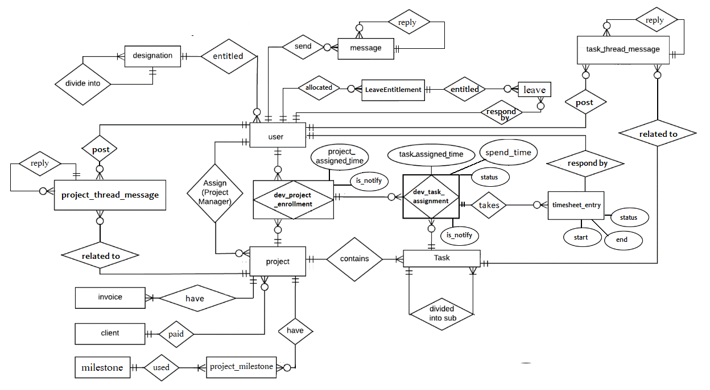

## ER diagram

## Overall class diagram

## 3. Overall Class Diagram for Entities

## 4. Collaboration Diagram 1 for view movie schedule usecase

## 5. Collaboration Diagram 2 for request ticket usecase
1. choose movie from movie schdule
2. request ticket for choosed movie

## 6. Collaboration Diagram 3 for purchase ticket usecase

## 7. Overall class diagram (including entity, boundary, controller classes)

description - what we going to do and 
two methods 
	1. draw whole diagram for the poroject and divide it onto module
	2. draw seperate class diagrams for each module

====1=====
project req
er
whole class diagram

====1=====
package anuuwa whole class diagram eka mark kirima

for each module use cases , entity attr, entity behaviours
===========

====2=====
for each module tasks seperate class diagrsms

	- module task list
	- module class diagram

for each module use cases , entity attr, entity behaviours
===========

