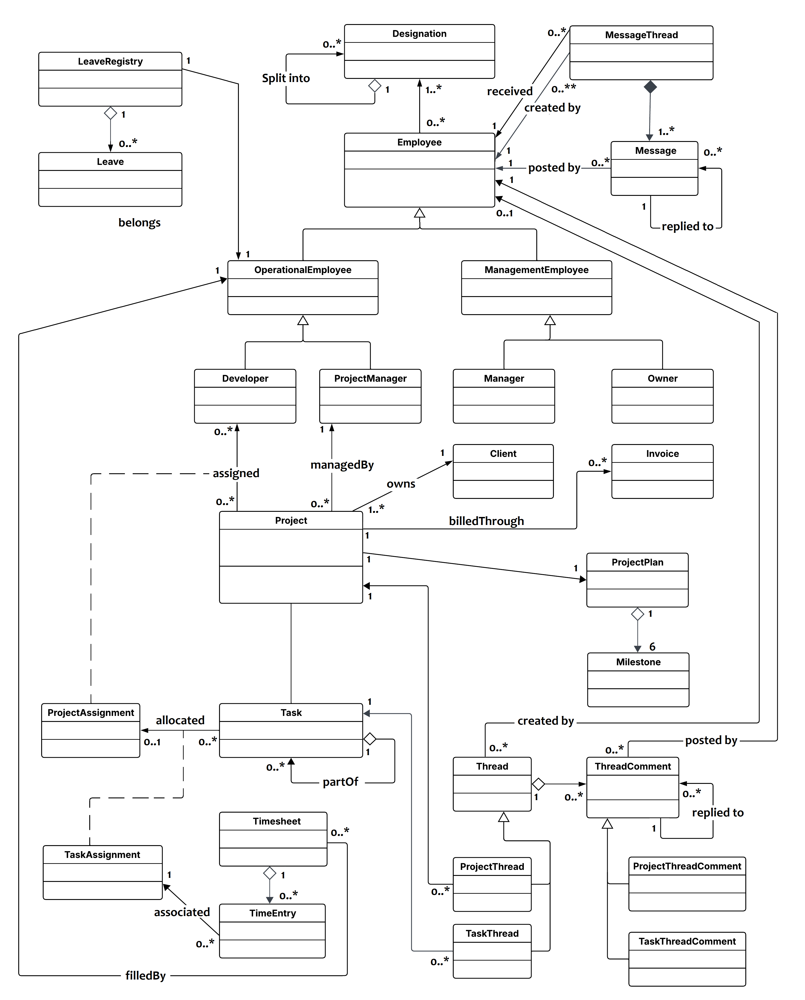

## description
what we going to do and .....

two methods 
	1. draw overall class diagram for the poroject and divide it into modules
	2. draw seperate class diagrams for each module

## ER diagram

## Overall class diagram

## Process 1 - draw class diagram for whole diagram for the project and divide it into modules
	mark each package in overall class diagram

	mention for each module use cases, entity attr, entity behaviours

## Process 2 - draw seperate class diagrams for each module
	for each module tasks seperate class diagrsms
		- module task list
		- module class diagram

	mention for each module use cases, entity attr, entity behaviours

